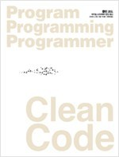

Clean Code를 읽었다. 육아에 지치고, 컴퓨터에 앉으면 코딩을 우선시하느라 당분간 책을 못 읽었었는데, 마음잡고 하루에 1챕터씩 읽어내려갔다. 하루에 1챕터라는 목표를 정하고, 애들 재우고 나와서 무조건 책을 읽고 다른 일을 시작한다고 정하니 확실히 목표를 달성할 수 있었다.

 책 내용은 코딩의 전반적인 권장 사항에 관해서이다. 결론을 요약하자면, "읽기 좋게 코드를 짜라. 테스트 코드를 짜라. 시간을 들여서 코드를 재검토해라"로 요약해볼 수 있겠다. 알면서도 지키지 못했던 부분들을 꼬집는 내용을 읽을 때마다 뜨끔뜨끔했다;; 그리고 어렴풋이 그러리라 생각했던 부분들을, 왜 그런지, 어떻게 해야하는지를 명확히 적어놓은 부분들이 많았다. 꼭 몸에 익히도록 해야겠다.

[구글 문서에 정리한 내용 링크](https://docs.google.com/document/d/1jLGEkWy5V7CCus5gWjioVJNMoAk3aBgRJHVISuA_hnE/pub)
