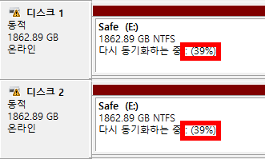

 윈도우10에서 RAID-1(Mirroring)으로 HDD를 사용 중인데, 어쩌다 디스크 관리에 들어가면 아래처럼 '다시 동기화하는 중(Resynching)'으로 나온다. 그런데 얼마나 동기화가 진행되었는지 그 퍼센트(아래에서 빨간 네모 안의 숫자)가 나오지 않는 경우가 있다.

  한동안 그냥 지켜보다가 꽤 오래 컴퓨터를 사용해도 퍼센트가 나오지 않길래 답답한 마음에 구글링을 해보니 꽤 옛날 자료가 많고해서 좀 뒤져본 결과, 윈도우10에서는 저 상황이 벌어지면 F5를 눌러주면 된다. 몇 십초쯤 뒤에 잘 나온다... 뭔가 억울하지만 여튼 퍼센트 잘 나온다.

  #다시동기화하는중 #Resynching #F5

