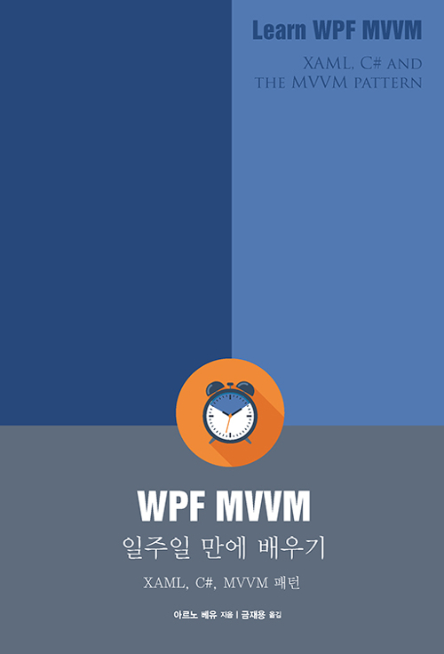

  간만에 얇고 재미있게 본 책이 있어서 소개해 본다.

 * 얇다. 212페이지다
 * C#이니, XML이니 이런거 알고 있다는 전제하에 WPF/MVVM이 뭐가 다른지 어떻게 쓰면 되는지를 핵심을 짚어서 설명해준다. 이게 정말 좋다
 * 이런/저런 것들도 있긴 하지만 잘 쓰이지 않는다고 얘기해준다. 이런건 키워드가 기억해뒀다가 필요할 때 그 키워드로 구글링을 잘해서 쓰면 된다

 https://github.com/zelon/wimygit 를 만들어보면서 너무 대충 코딩했는데 이제 코드 정리를 어떤 식으로 해야하는지, WPF를 어떤 식으로 써야하는지 감이 잡혔다. 물론 좀 더 전문적인 책을 보면 좋겠지만, WPF의 핵심을 파악하는데는 무척 유용한 책이었다
 