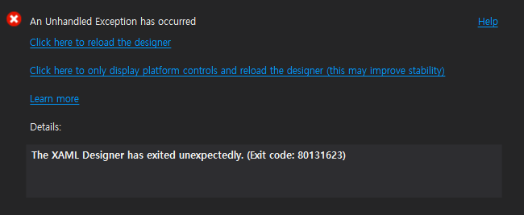

 .NET Core 3.0으로 WPF로 GUI Git client(https://github.com/zelon/wimygit)를 취미삼아 만들고 있는데, 특정 상황에서 Visual Studio의 WPF Designer View에서 80131623 에러를 내면서 제대로 미리보기를 보여주지 않았다. 버그 리포팅을 해도 묵묵부답이고... 뭔가 내 컴퓨터에서만 발생하는 문제인가 싶기도 한데, window10의 샌드박스에서 테스트해도, Visual Studio 2019 preview 버전에서도 같은 문제가 발생했다.
 
 

  문제의 원인은 XAML 코드를 여기저기 주석처리하다가 알았는데, ListBox에 MultiBinding을 사용할 때였다. 문제도 없는 코드이고 빌드 및 실행도 잘되는데, XAML preview에서만 'The XAML Designer has exited unexpectedly. (Exit code: 80131623)' 과 같은 화면을 띄우면서 preview를 보여주지 못했다. 이런저런 방법을 써도 잘 안되다가 정말 엉뚱한 방법으로 문제를 회피(!)했다. 바로 MultiBinding Coverter에 사용되는 클래스 이름을 바꾸는 것. 희안하게 클래스의 이름을 줄였더니 이 문제가 회피가 되었는데, 웃기는 것이 XAML Designer에서는 새롭게 변경한 클래스 이름을 발견을 못한다. 그래서 경고 밑줄을 띄우면서, preview는 잘보여준다. 아마 내가 사용했던 클래스 이름이 반쯤(?) 인식되어서 뭔가 동작을 하다가 멈춘게 아닌가 생각된다. 이름을 더 길게도 해보고 어떤 패턴이나 어떤 단어에 문제가 생기는 지 더 찾고 싶지만 이 문제에 너무 오래 시달려서 일단 preview가 보이는 데서 만족하고 포스팅 중...

  혹시나 이런 문제를 겪는 사람이 있다면 일단 클래스 이름을 바꿔 보시길.
