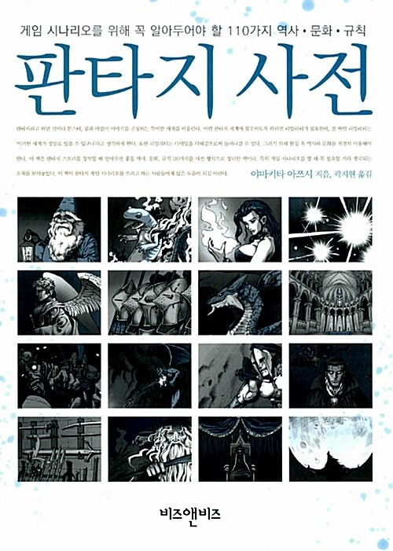

 

 판타지 사전. 어디선가 잠깐 봤는데 너무 사고 싶다는 생각이 들어서 사놓고는 정말 조금씩 조금씩 완독했다. 책도 얇고(260페이지), 단락마다 따로 읽기 좋다.

 이 책은 판타지 세계에 등장하는 모든 것들에 대해 설명하고 있다. 무기, 세계관, 종교, 마법, 언데드, 상점에 대해 짧고 핵심적인 내용을 소개해준다.

  '사제와 주교는 누가 더 높은 계급인가', '성창 - 못 박힌 그리스도를 찌른 창. 롱기누스의 창이라고 하며, 히틀러도 그 행방을 찾았다고 전해진다', '던전은 이런저런 이유로 감옥을 던전이라고 부르게 되면서...', '악마의 계급 체계는...' 와 같은 형태로 적절한 그림과 함께 설명하고 있다.

  게임 업계에 종사하는 사람은 무조건 한 번 읽어보라고 권하고 싶다. 아마 게임을 좋아하는 모든 사람, 그리고 영화계에 있는 사람들도 한번쯤은 흥미있게 읽을 수 있을 것 같다.