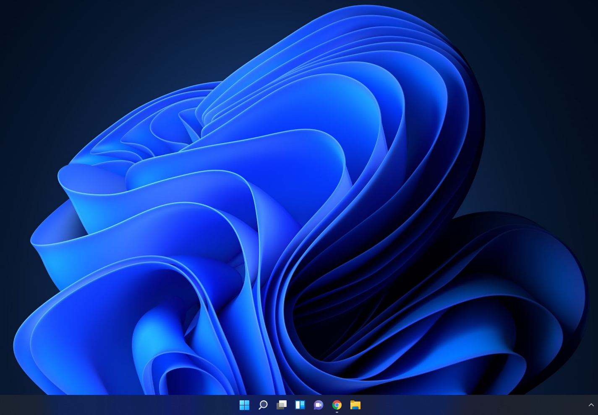
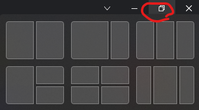

 얼마전(10월 5일)에 윈도우11이 출시되었다. 늦게나마 세컨드 컴퓨터에 설치해서 써보려고 하는데 세컨드 컴퓨터의 사양은 2010년에 발매된 i7-930 이다. TPM이니, UEFI니 이런거 없다.

 인터넷을 좀 찾아보니 윈도우11에서 요구하는 사양들을 통과하는 레지스트리 설정이 있었다. 레지스트리의 특정 위치에 특정 제약 사항들을 체크하지 않는 설정을 하는 것이다. 참고: https://www.techpowerup.com/287584/windows-11-tpm-requirement-bypass-it-in-5-minutes

* 윈도우11 iso 파일 다운받아서 USB 드라이브에 넣어준다
* [bypass.reg 링크](bypass.reg) 파일을 설치용 USB 드라이브에 복사-붙여넣기로 넣어준다
* USB 드라이브로 부팅
* 설치 시작 화면에서 Shift+F10 을 누른 후 regedit 엔터
* 레지스트리 편집기에서 파일 -> 가져오기 를 통해서 해당 bypass.reg 파일을 연다
* 일반적인 설치 과정 진행

위와 같이, 설치 과정에서 해당 레지스트리를 입력해주면 관련 사양 체크없이 설치가 된다. i7-930, 12GB RAM, HDD, GeForce 210 의 사양으로도 딱히 윈도우10과 다를바 없이 설치 및 사용이 가능하다.

잠깐 써보니 설정창이 꽤 바뀐 것 외에는 크게 와닿는게 없고, 아래의 스샷처럼 전체화면 아이콘을 마우스를 오버하면 적절한 크기로 창을 키울 수 있다. 큰 모니터를 사용할 때 꽤 유용하게 사용할 수 있을 것 같다

