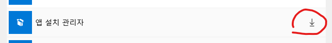
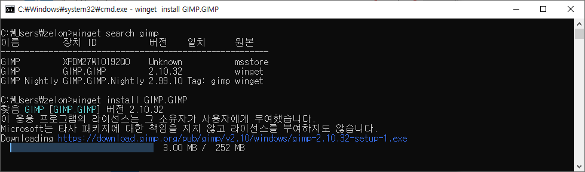

 리눅스 진영에는 apt, yum 같은 패키지 관리자들이 오래전부터 존재하여 쉽게 패키지, 프로그램들을 설치할 수 있었다. 윈도우에도 WinStore 같은게 있지만 GUI 기반이고 이런저런 문제로 많이 쓰이고 있지는 않다. 우분투의 apt(이전에는 aptget)에 영향을 받아서인지, 최근에 winget(https://learn.microsoft.com/ko-kr/windows/package-manager/winget/)이라는 게 만들어져서 조금 써봤는데 그냥 apt 의 윈도우 버전이라고 보면 될 것 같다. 모든 것이 winget에 있다고 할 수는 없지만 상당히 많은 프로그램들이 winget 으로도 설치할 수 있게 된 상황이다

 winget을 사용하려면, 윈도우10 이상의 윈도우즈가 설치되어 있어야 하고, 가능하면 최신 업데이트가 되어 있어야 한다. Windows 10 1709 이전 버전의 윈도우에서는 제공되지 않는다. 하지만 1709 이상 버전이라고 바로 winget을 사용할 수 있는게 아니다. 아래의 간단한 과정을 거쳐야 사용할 수 있다

 * Microsoft Store 앱에서 '다운로드 및 업데이트' 클릭

 

* '앱 설치 관리자' 업데이트

* 다운로드 완료 기다리기

* 다운로드가 완료되면 콘솔창(cmd, powershell)에서 winget 명령어를 사용할 수 있음(첫 실행 시에 라이센스 동의 필요)

 예를 들어 gimp 를 설치하고 싶다고 하면 아래와 같이 search 해본 다음에 install 명령으로 설치하면 자동으로 설치 파일을 다운로드 받아서 실행해준다

 

  2022년 10월 기준 아래와 같은 패키지들이 사용가능하다. 주로 내가 사용하는 것들만 나열해봤는데, search 명령으로 더 많이 찾아볼 수 있다. 

* Chrome
* 7zip
* Everything
* qBittorrent
* VLC
* Audacity
* Visual Studio 2022 포함 모든 버젼
* Python3
* gVim
* Steam
* EpicGamesLauncher
* DockerDesktop
* Visual Studio Code

