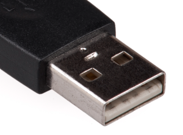

 6월말부터 7월초까지 10일간 영국 런던 여행에 대한 정리. 런던 여행을 계획하는 분들, 특히 가족 여행을 위한 최신 정보가 되었으면 좋겠다

 * 4인 가족, 아빠/엄마/딸/아들
 * 자유여행. 호텔, 항공 모두 인터파크에서 직접 예약
 * 렌트카 안함. 지하철, 버스, 기차 타고 여행

 * 2023년 7월 기준 영국 입국시에 코로나19 입국제한 조치는 전면 해제되었다. 그래서 입국 시에 백신 접종서 같은 것을 가지고 가야하나, 백신을 맞아야 하나 걱정할 필요가 없다. 여기에 대해 여기저기 검색해보면 다 괜찮다고 말은 하는데 괜히 가족 여행을 망치면 안되어서 제일 믿음이 가는 곳을 찾아내었다. 주영국 대한민국 대사관의 공지내용 - 영국정부 코로나19 입국제한 조치 전면 해제 안내(https://overseas.mofa.go.kr/gb-ko/brd/m_25447/view.do?seq=1345083&page=5)이다.
 * 영국은 유로가 아닌 파운드를 사용한다(GBP)
 * 영국 여행 책은 실물로 하나쯤 구입해두면 좋다. 특히 코로나 이전 정보가 있는 책들이 많으니, 항상 최신판인지 확인하고 구입하자. 나는 저스트고/프렌즈가 순위가 높아서 둘다 구입해보았는데 여행정보는 저스트고가 조금 더 낫고, 런던에 대한 읽을거리는 프렌즈에 좀 더 점수를 주고 싶다
 * 아시아나 비행기를 탔는데, 생각보다 비행기에서 제공하는 영화/예능 등이 꽤 종류가 많아서 시간을 보낼만 했다
 * 아시아나 항공에서 키즈밀(kids-meal, child-meal)로 검색해보면 탑승 24시간 전에 주문하면 어린이용 기내식을 제공해준다. 아이마다 호불호가 있을 수 있으나, 받아보고 아이가 싫어하면 엄마나 아빠의 식사를 바꿔주면 되니 아이가 있다면 주문해두자
 * 비행기표 구입 후 비행기 좌석 위치를 미리 지정할 수 있다. 구입한 곳의 메뉴, 항공사 홈페이지의 메뉴를 잘 찾아보자. 아이들이 해외여행이 처음이라면 창가에 미리 지정하면 당연히 좋아한다
 * USB-A 로 꽂을 수 있는 휴대폰 케이블을 하나씩 챙겨가면 좋다. 공항 버스, 비행기, 기차 안에서도 이 단자가 있는 곳이 많아서 짬짬이 충전하기 좋다
 

 * 영국 영어가 미국 영어와 다르다고 여행책에 여러개의 단어가 소개되는데 한번쯤 읽고 가면 좋다. 참고로 책에는 elevator -> lift 라고 적혀있지만 외국인을 배려해서 인지 elevator 도 종종 있다
 * 식당에서 아이와 함께 식사를 할 때 제일 많이 필요한 영어는 table for four?(4명용 테이블인가요?), side plates?(앞접시 드릴까요?)
 * 팁 문화는 대부분의 경우(호텔 레스토랑 포함) 달라는 곳이 없었고, 영수증에 service charge 등으로 포함되어 있다고 보면 된다. 10일 중 딱 1군데 식당(wagamama)에서 카드 결제할 때 팁을 입력해달라고 했다. 안 줘도 된다고 하지만 10% 정도 팁을 주었다
 * 아이랑 여행하는데 힘든 게 화장실이다. 책에서도 설명이 잘 되어 있는데, 한국에는 대부분의 공용 화장실이 무료이지만, 런던에는 무료 화장실이 없는 곳들이 많으므로(심지어 공원 화장실도 유료인 곳도 종종 있다), 음식점에서 나갈 때는 아이들의 화장실을 잘 챙기자. 참고로 지하철 화장실은 어린 아이가 싫어할 정도로 위생상태가 안 좋은 곳도 있다. 화장실 입장료가 0.5파운드, 0.2파운드도 있고, 동전만 받는 곳(잔돈은 안 준다), 카드로만 받는 곳도 있다. 참고로 지하철이 아닌 기차(train)는 중간에 화장실이 있다. 대형 시설에서는 대부분 무료인데, 화장실 줄이 길다면 다른 코너의 화장실을 찾아보자. 이번 여행에는 대영박물관의 모든 화장실이 붐볐는데, 그 중 피자리아 화장실은 늘 한산했다. 여튼 아이들 화장실은 잘 챙기자
 * 오이스터 카드 충전은 5파운드 단위로 할 수 있는데 하루에 지하철/버스를 많이 타도 7파운드 제한이 있으니 숙박일수에 7곱하면 대략 된다
 * 해리포터 스튜디오의 공식 홈페이지에서의 예약은 1달 전에 하는 것은 불가능하다. 미리 할 수 없다면 구입 대행 업체들(마이리얼트립 등)을 통해서 시도해보자. 참고로 대행 업체들은 입장권과 다른 상품(기차표등)을 묶어서 판다. 해리포터 스튜디오에 갈 예정이 있다면 킹스크로스역의 9와 4분의 3플랫폼은 안 가도 된다. 꽤 줄이 길기도 하고, 해리포터 스튜디오에 비슷하게 사진을 찍을 수 있는 곳이 있다(심지어 3종류의 포토존). 참고로 해리포터 지팡이, 해리포터 펜촉은 기내 수화물이 가능했다
 * 토트넘 경기장에 방문하는 일정이 있었는데, 토트넘 지역이 런던에서 좀 멀리 있어서 간 김에 둘러볼만 한 곳이 있는지 주위를 검색해봤다. 아이들 중에 한 명이 꼬마흡혈귀 소설을 좋아해서, 토트넘 묘지에 잠깐 들러서 분위기를 느끼고 왔다
 * 호텔 체크아웃 후 비행기 타는 시간이 좀 늦다면 캐리어를 보관해주는 서비스를 찾아보자. 대형 기차역 등에도 종종 있고, 묵었던 호텔에서도 Luggage Storage 서비스를 제공해주기도 한다. 호텔에 따라다르겠지만 내가 이용한 호텔에서는 체크아웃 후에도 보관해준다고 확인 받고 이용했다
 * 히드로공항 2터미널은 제법 괜찮은 기념품가게와 과자 초콜릿 등을 판다. 작은 선물들은 여기서 사도 될듯
 * 귀국 비행기에서 세관 관련 적던 서류가 사라졌다(신고할 물품이 있는 사람만 적도록 바뀜). 대신에 코로나 관련하여 건강 체크하는 서류가 생겼다(미리 Q-code 로 인터넷으로 입력하는 방법도 있다)
 * 귀국 후 인천공항에서 홀린 듯이 경기도/서울가는 버스를 대면으로 표를 구입했는데, 무인발권기가 있다

