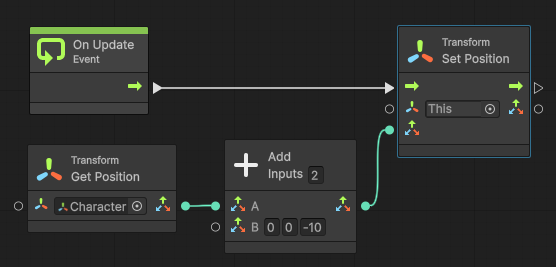

 아들이 학교에서 배우는 간단한 블럭 프로그래밍으로 작은 게임을 하나 만들어보더니 아빠는 어떻게 게임 만드냐면서 물어보길래 집의 서브 컴퓨터를 아들방에 넣어주고 게임 엔진을 설치해주었다. 언리얼 엔진으로 BP(BluePrint) 를 쓰면 학교에서 배운 블럭 프로그래밍과 비슷한 느낌이 날 것 같았는데, 컴퓨터 사양이 낮아서 언리얼 엔진은 구동에 실패하고 유니티는 실행에 성공했다. 그래서 언리얼의 BP 와 비슷한 게 혹시 생겼나싶어서 찾아보니 유니티에도 비주얼 스크립트(Visual Script)가 생겨서 아들과 같이 사용해보았다

 사용법은 블럭 프로그래밍을 배웠다면 꽤 직관적으로 만들 수 있었는데, 역시나 다른 객체의 정보를 얻어오고 상태 저장 등을 하려면 변수 개념이 필요했고, 한번 해보면 쉬운데 막상 뭔가를 하려니 하나 하나 부딪혀가면서 해야했다.

  그중에 게임의 기본 기능 중 하나인, 캐릭터를 따라가는 카메라를 만들어보았는데, 역시나 알고하면 금방인데 막상 처음부터 하려니 잘 되지 않았고, 아직 비주얼 스크립팅에 대한 자료가 많지는 않아서(특히 책으로 나온 건 없다) 나중에 다시 찾아볼 겸 적어본다

 * 비주얼 스크립팅을 사용하려면 Unity 2021 버전 이상을 사용해야 한다. 그 전 버전에서는 Asset Store 에서 다운받아야 한다
 * File 메뉴 -> Project Settings -> Visual Scripting -> Initialize 해야 한다
 * 카메라 객체에 'Add Component' 해서, Visual Scripting -> Script Machine 한다
 * Source 를 Embed 로 바꾼 후, 'Edit Graph' 를 눌러서 그래프 편집을 한다
 * 아래처럼 노드를 구성한다

 

 잠깐 설명해보자면, On Update Event 시(화면이 갱신될 때마다)에 This(Camera) 객체의 Position 을 Set 해주는데, Set 해주는 좌표는, Character 객체의 Transform 컴포넌트의 GetPosition 값을 가져와서, Z 값만 -10 한 값으로 해준다. 즉, 카메라 위치를 Character 객체 좌표로부터 Z축으로 -10만큼 떨어진 곳으로 해준다. -10 을 해주는 이유는 완전 같은 곳에 위치시키면 카메라가 객체를 제대로 비춰주지 못해서 화면에 그려지지 않기 때문이다

 이 형태와 개념만 어느 정도 익혀두고, Graph 를 다른 곳에서도 사용하는 개념만 익히면 큰 틀에서 비주얼 스크립팅을 적절히 사용할 수 있을 것 같다
