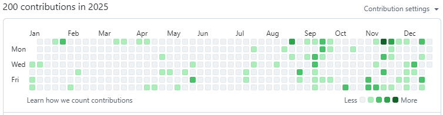

 요즘은 블로그에 글을 잘 적지 않았는데 그래도 2025년을 정리하는 기분으로 2025년 결산글을 적어본다

# 책
 2025년에는 AI, 자전거, 김용의 소설이었다

- 요즘 바이브 코딩 클로드 코드 완벽 가이드
- 한 걸음 앞선 개발자가 지금 꼭 알아야 할 클로드 코드
  - AI가 한창이라... 교보문고에 가족들과 함께 들렀는데 프로그래밍 베스트 분야에서 AI는 70,80프로가 다 클로드 코드였음. 업무와 개인 공부에 도움이 되기 위해서 열심히 읽고 적용해보는 중.
- 생성형 AI와 함께하는 게임 개발 유니티 6 독학노트
- C++20: 풍부한 예제로 익히는 핵심 기능
- 서울 자가에 대기업 다니는 김 부장 이야기
  - 드라마화 되기 직전에 아는 동생의 추천으로 읽었음
- 누가 내치즈를 옮겼을까
  - 이것도 '밀리의서재'에 있길래 다시 읽어봄
- 쿠버네티스 입문
- 닥치는 대로 끌리는 대로 오직 재미있게 이동진 독서법
- 자전거의 거의 모든 것
- 궁극의 자전거 매뉴얼
- 사조영웅전 / 신조협려 / 의천도룡기
  - 고등학교 때 수학시간 빼고 모든 수업시간에 열심히 읽었던 책. 기억이 희미해져서 언젠가 다시 보고 싶었는데 '밀리의서재' 에 모든 시리즈가 있어서 다시 읽어봤다. 다시 보니 내가 본 건 '사조영웅전' 뿐이었었고, 그 내용도 90%는 다 잊어버린 듯. 역시 무협지 중 가장 유명한 책답게 많은 책의 모티브가 된 작품인 것 같다. 열심히 재미있게 읽었다
- 1%를 읽는 힘
  - 주식에 크게 관심은 없었지만 아들이 생일 선물로 사준 책. 주식이라고 하지만 이런저런 잡학에 관한 재미있는 이야기들이 많아서 무척 재미있게 읽었다. 세계 정세의 뒤에서 움직이고 있는 돈의 흐름이라든지, 건물 높이는 인접한 도로 폭의 1.5배라든지...

# 만화책
 요즘은 가능하면 전자책만 구매한다. 집에 둘 곳도 없고, 이제 전자책에 거부감도 거의 없고 태블릿이 있어서 일듯... '밀리의서재'를 구독하고, 없는 책은 알라딘 전자책에서 사서 본다

- 원피스
  - 2024년말부터 쭈욱 정주행해서 나와있는 110권까지 봤다
- 괴수8호
  - 가이버가 생각나서 봤는데 좀 달랐지만 무척 재미있게 읽었다. 이제 마지막 완결본만 남았음
- 흑박물관 초승달이여, 괴물과 춤추어라
  - 요괴 호야, 꼭두각시 서커스의 작가의 작품이라 찾아봄. 재미는 일단 보장

# GitHub Graph
 조금 적었나 싶긴하다. 7월쯤부터 마음의 여유를 조금 찾은듯.

# 재미있게 만들어본 것
- Excel Diff(https://github.com/zelon/excel-diff). Claude 한테만 시켜서 완성해봄. 회사에서 엑셀 파일 diff 할 때 써볼까 싶음
역시나 AI 한테 시켜서 만들어본 것
- 틈틈이 만들고 있는 Git GUI Client 인 WimyGit(https://github.com/zelon/wimygit) 을 winget 에 release 해본 것. 이제 윈도우10의 지원이 끝나고, 윈도우11로 넘어가는데 winget 은 윈도우11에 기본 설치된 패키지 매니저이다. 여기에 내가 만든 프로그램을 넣어보는 것 신나는 경험이었다. 이제 윈도우 설치하고 `winget install Wimysoft.WimyGit` 로 wimygit 을 바로 설치할 수 있다. 설치 후 `wimygit` 을 실행하면 바로 실행된다
- Github action 해봄. wimygit 을 winget 으로 release 할 때 사용해봤는데, CI/CD 에서의 표준처럼 여겨지고 있어서 꽤 재미있는 경험이었다. Github 가 사실 프로그래밍의 표준이니 당연한 포지션일 것 같다
- docker 로 jenkins 구축해본 것. 언젠가는 다시 jenkins 를 써보고 싶었는데 기회가 되어서, docker/jenkins 조합을 구축해보았다. agent 들을 docker image 로 배포하는 방식이 확실히 편하다는 것을 실감했다. 덕분에 docker 를 제대로 써볼 기회가 되었다
- docker 로 jenkins 를 구축해본 결과와 꾸준히 mssql windows docker image 를 시도해본 결과로, 기존 개발하던 게임 서버용 docker image 를 만들어서 배포해보았다. 7년전부터 해보고 싶었던 것인데 이제 드디어 해보았다. 뿌듯했다.
- 둘째 아들내미 학교 장기자랑 시간에 발표하겠다고 함께 유니티로 만들어본 게임. 하늘에서 떨어지는 고드름을 피하는 기본적인 게임이었는데 유니티2D 기능을 사용해서 간단히 만들어봤다. 아들과 함께한 시간. 그리고 아들이 흥미를 가지고 이것저것 물어보고 게임을 어떻게 만들어가는지 탐색하는 시간이 즐거웠다

# 자전거
 둘째 아들 친구들의 아빠들과 자전거를 타게 되었다. 원래 자전거를 좋아해서 출퇴근을 자전거로 하곤 했는데, 같이 자전거를 타게 되면서 로드 자전거를 하나 얻어서 주말에 하루는 4~5시간 정도 자전거를 타게 되었다. 이렇게 열심히 타는 건 작년 회사 동료분들과 함께 한강 간 적이 처음이었는데 매주 4~5시간씩 타니 정말 재미있는 경험이었고 몸도 훨씬 좋아지는 느낌이었다. 집에서 두물머리까지 왕복하는 게 목표였으나 이런저런 이유로 못해서 아쉽게 되었다. 2026년에 다시 도전해볼 예정!!

 
- 가본 곳: 한강/청계사/망해암/백운호수공원/하오고개/여우고개/기흥호수공원/광교호수공원/왕송호수공원/반포대교/팔당댐

그리고 기세를 몰아서 가족 4명이 모두 집~한강 왕복!! 나윤이가 많이 힘들어하긴 했지만... 기억에 남는 가족 활동이었을 듯 ㅎㅎ

# 말해보카 영어공부
 1월 26일에 마스터 리그로 진입하며 열심히 했었으나 출퇴근을 자전거로 하기 시작하면서 출근 시간에 지난 문장들 듣기만 하고 있다. 그나마 주말에 조금씩 하기는 하는데... ㅠㅜ 영어를 놓지만 않고 있는 상태다. 2026년에는 주말에라도 계속 해야하지 않나 싶다

# 한 해 사진 돌아보기
- 2025년 내 생일에 가족끼리 처음으로 오마카세에 가보았다. 아이들이랑 언젠가는 가봐야지 싶었는데 회사 앞에 가성비 좋은 초밥집(https://place.map.kakao.com/1094403128)이 있어서 가족끼리 한번 가보았다. 다행히 아이들도 아내도 모두 너무 만족해서 좋았다
- 나윤이가 기타를 배우기 시작했다. 우쿠렐레를 배운적이 있어서인지 처음부터 제법 잘 친다. 일주일에 한번 가는데 선생님께서 '너는 알아서 잘하니까' 라면서 다른 아이들과 다른 진도로 가르쳐주신다고 한다. 예체능계에 소질이 있는듯
- 3월달에 수빈이네랑 몇시간짜리 캠핑
- ChatGPT 로 지브리 가족 사진 만들기
- 어머니가 많이 회복되셔서 재활 치료 시작 & 대상포진
- NC 에서 First Spark Games 로 분사
- '솔이'(크레스티드 게코) 입양
- 자전거는 DOMARS R21
- 5월 전주한옥마을 & 국립생태원(주호 가족 만남!!)
- 건후 학교대항 축구대회(5~6학년) 준우승
- 65인치 TV 가 우리 집에 드디어 들어옴. 아내의 허락이 필요업는, 장인어른의 선물이었음
- 롯데타워 시그니엘 방문 및 롯데타워 전망대 가봄
- Goodbye 장수풍뎅이
- 접시돌리기
- 건후 1학년 4반 친구들 미니운동회
- 가족과 한강 자전거 왕복
- 샌디에고 두번째 출장 to Amazon Games
  - Midway 박물관은 정말 꼭 가봐야 한다!!!
- NDC 에서 재호님과 재윤님, 현희님과 태현님 발표함
- 나윤이랑 둘이 대부도 방문
- 폭우 쏟아지는 여름날 건후 축구 대표팀 훈련
- 나윤이랑 둘이 루프캣미 고양이카페
- 7월말 여름 휴가 '고성 - 청간해변', 서피 비치, 낙산사, 한계령
- 건후 3D pen with 사나고
- 수빈이네랑 아마조네스 물놀이, 서핑보드 체험
- 건후 수빈 지유 서현에서 모임
- 거실 LED 3개 중 1개 교체
- 식탁이 거실로 와서 공부 탁자가 됨
- 건후의 귀멸의칼날 전집
- 나윤이의 진격의 거인
- 2025년 10월 10일 대한민국 vs 브라질 관람. 손흥민,이강인,김민재
- 구미에서 기차타고 대구 왕복
- 수빈이네랑 서울동물원
- 한겨울에도 자전기타기 위해 헬멧 구입
- FSG 팀장 워크샵
- 나윤이 생일 기념 네일 아트 및 클리어
- 우태님,득원님,효진님 퇴사

# 게임
 아이들이 한창 공부할 나이여서, 공부하는 애들 앞에서 게임을 하는게 애매해서 늘 게임을 마음껏 하지는 못한다. 아이들의 취침시간도 이젠 제법 늦어져서 평일에는 거의 할 수가 없다...

- Doom 1
  - Steam 에서 collection 으로 묶어서 '고전 둠'으로 팔길래 워낙 좋아했던 게임이라 다시 해봤다. 역시나 레벨 디자인은 다시해도 재미있게 잘 되어 있는 명작이다. 지금 시선에서 바라본 그래픽은 그당시의 한정적인 기술력으로 어떻게 표현을 했는지 다시 생각해볼 기회를 준다
- Virtua Fighter
  - 꾸준히 한번씩 하는 게임. 게임성은 크게 변화가 없지만 심신수련하듯이 꾸준히 한번씩 한다
- 철권8
  - 형이랑 한번씩한다
- 클래시 로얄
  - 지우고 다시 설치. 지우고 다시 설치... 간단히 하기 좋아서 결국 다시 설치해서 계속 플레이한다. 짧은 플레이 타임과 PvP로 모바일 환경에서 최적화된 게임이지 않을까 싶다

# 영화
- 모아나2
  - 1편은 거의 인생 애니메이션이었는데 그만큼의 감동은 아닌듯. 원래 드라마로 나오려던 것을 영화로 만들었다고 함
- 주토피아2
  - 유쾌한 기존 플롯을 잘 따라서 다시 잘 만든 2편!!
- 프랑켄슈타인
- 일렉트라
- 길복순/사마귀
- 84제곱미터
- 무도실무관
- 야댱
- 거룩한 밤 데몬헌터스
- 케이팝 데몬헌터스
- 썬더볼츠
- 캡틴 아메리카: 브레이브 뉴 월드

# 시리즈
- 오징어 게임2
- 기묘한 이야기
  - 대단원의 끝을 맺었다. 꽤 멋진 결말이었다. 내 어릴적 친구들을 생각나게 한다
- 플래시
  - 시즌이 너무 많아... 봐도봐도 끝이 안 난다...
- 런닝맨
  - 가족과 늘 함께보는 예능 프로

## 기타
- 침대 삼
- TV 들어옴
- 게이밍 헤드셋 경품 당첨

  
  
 
 

# 2026년...
- 언리얼 데디케이트 써보기
- rust 로 게임 서버 기본 만들어보기
- 두물머리 자전거 왕복

 2026년도 열심히 살아보자~~!!